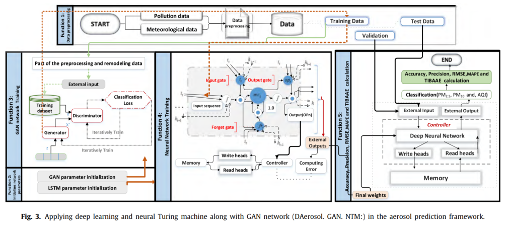

# NTM-GAN-LSTM

A hybrid deep learning framework for **air quality prediction**, combining:
- **Neural Turing Machines (NTM)** for memory-augmented learning,
- **Generative Adversarial Networks (GAN)** for synthetic data generation and missing value recovery,
- **Long Short-Term Memory (LSTM)** networks for time series forecasting.

This repository implements the **DAerosol.GAN.NTM** framework proposed in:

> Zahra-Sadat Asaei-Moamam, Faramarz Safi-Esfahani, Seyedali Mirjalili, et al.  
> *Air quality particulate-pollution prediction applying GAN network and the Neural Turing Machine.*  
> Applied Soft Computing, Volume 147, 2023, 110723.  
> [DOI: 10.1016/j.asoc.2023.110723](https://doi.org/10.1016/j.asoc.2023.110723)

---

## 🧠 Motivation

Urban air quality—especially the concentration of **PM2.5**, **PM10**, and **AQI**—has major health and environmental implications.  
This project addresses prediction challenges using a hybrid DL model that:

- Handles **missing sensor data** using GAN-generated imputation.
- Leverages **external memory via NTM** for long-term dependency tracking.
- Improves accuracy over conventional DNN, LSTM, DLSTM, and MLP baselines.

---


---

## 🧬 Model Architecture Overview

The following diagram illustrates the **DAerosol.GAN.NTM** framework as proposed in the paper. It showcases the integration of:

- **GAN** for generating and restoring missing or corrupted pollution data
- **NTM controller with LSTM** for time-series prediction using external memory
- **Deep Neural Network** evaluation with final prediction for PM2.5, PM10, and AQI
- **TIBAAE** (Time Interval Before and After Aerosol Event) for surge prediction



*Fig. 3 from the published article, depicting the end-to-end deep learning pipeline for aerosol prediction.*


## 📁 Project Structure

```
NTM-GAN-LSTM/
│
├── GAN.py                  # GAN module for synthetic data generation
├── DL-LSTM.py              # Deep LSTM and controller logic for NTM
├── DataSet-70%train&30%test-OK.xlsx  # Cleaned and processed dataset
├── README.md
```

---

## 📊 Dataset

The dataset includes meteorological and air pollution records from **Tehran**, covering over 20 years, across 15 pollution sensors and 4 weather stations. It includes:

- Meteorological features: temperature, humidity, visibility, wind, pressure, cloud layers
- Pollution measures: PM2.5, PM10, AQI, CO, NO2, O3, SO2

---

## 🚀 How to Run

1. Install dependencies:
```bash
pip install numpy pandas keras tensorflow
```

2. Run the GAN preprocessor:
```bash
python GAN.py
```

3. Run the prediction model:
```bash
python DL-LSTM.py
```

> 📝 Note: Scripts are built using Python 3.6+, TensorFlow (via Keras), and were originally tested in an Anaconda environment.

---

## 📈 Performance Metrics

The model evaluates performance using:
- **Accuracy**
- **Precision**
- **RMSE (Root Mean Square Error)**
- **MAPE (Mean Absolute Percentage Error)**
- **TIBAAE (Time Interval Before and After Aerosol Event)**

Achieved up to:
- **PM2.5: 96% accuracy**
- **PM10: 97% accuracy**
- **AQI: 82% accuracy**

---

## 📌 Citation

If you use this work, please cite the following paper:

```bibtex
@article{asaei2023ntmgan,
  title = {Air quality particulate-pollution prediction applying GAN network and the Neural Turing Machine},
  author = {Asaei-Moamam, Zahra-Sadat and Safi-Esfahani, Faramarz and Mirjalili, Seyedali and Mohammadpour, Reza and Nadimi-Shahraki, Mohamad-Hosein},
  journal = {Applied Soft Computing},
  volume = {147},
  pages = {110723},
  year = {2023},
  publisher = {Elsevier}
}
```

---

## 📬 Contact

For questions or collaborations:

- Zahra-Sadat Asaei-Moamam – `zahraasaei@sco.iaun.ac.ir`  
- Faramarz Safi-Esfahani – `safi@iaun.ac.ir`

---

## 🛡 License

This research code is shared for academic use only. Please consult the authors before any commercial use.
